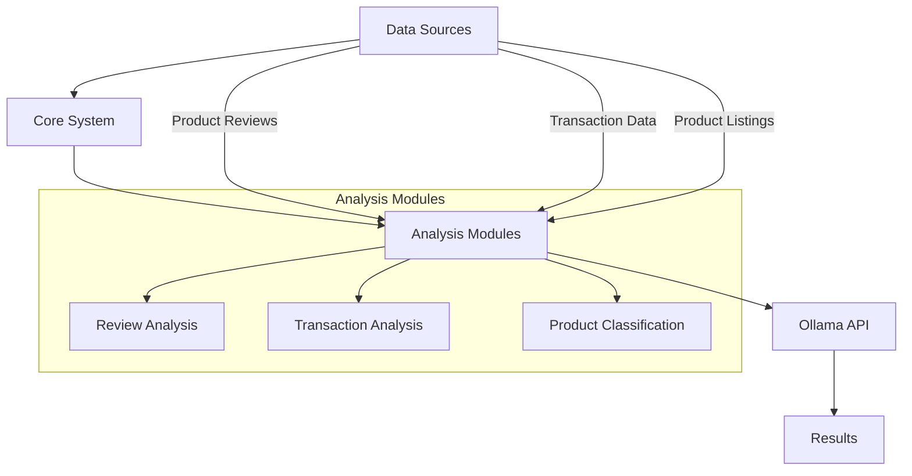

# Ollama E-commerce Analytics


A Python framework leveraging Ollama API for advanced e-commerce analytics including product classification, sentiment analysis, and fraud detection - optimized for sustainable e-commerce businesses.

## Overview

The Ollama E-commerce Analytics System processes various e-commerce data points to:
- Classify sustainable products
- Analyze customer sentiment from reviews
- Detect fraudulent transactions
- Optimize model selection based on computational needs

## Features

### Core Modules
- **Product Classification**: AI-powered categorization into custom categories
- **Review Analysis**: Sentiment extraction and key insights from customer feedback
- **Transaction Analysis**: Fraud pattern detection in financial data
- **Model Management**: Dynamic model selection based on workload

### Advanced Capabilities
- Batch processing for large datasets
- Customizable analysis parameters
- JSON-formatted outputs for integration
- Local model support via Ollama

## System Architecture



## Prerequisites

- Python 3.8+
- Ollama installed locally ([installation guide](https://ollama.ai/))
- Required models (automatically pulled on first run):
  - `llama3:instruct`
  - `mistral`

## Installation

1. Clone the repository:
```bash
git clone https://github.com/luisdh8/ollama-ecomerce.git
cd ollama-ecomerce
```

2. Install dependencies:
```bash
pip install -r requirements.txt
```

3. Set up environment:
```bash
cp .env.example .env
```
Edit the `.env` file with your preferences:
```ini
OLLAMA_BASE_URL=http://localhost:11434
OLLAMA_MODEL=llama3:instruct
```

## Usage

### Core Functionality

```python
from analytics.review_analyzer import analyze_sentiment

results = analyze_sentiment("datos/reviews_producto.txt")
print(results)
```

### Product Classification
```bash
python clasificador.py
```
Interactive mode:
1. Enter categories (comma-separated)
2. Input product names
3. Get instant classification

### Transaction Analysis
```bash
python analizador_transacciones.py datos/transacciones.csv
```

### Review Analysis
```bash
python analizador_sentimientos.py datos/reviews/
```

## Module Documentation

### `clasificador.py`
- `clasifica_productos(nombre_producto, categorias)`: Classifies products
- Interactive mode with category suggestions

### `analizador_transacciones.py`
- `analizar_transacciones(archivo_csv)`: Processes transaction files
- Outputs JSON with fraud flags

### `analizador_sentimientos.py`
- `analizar_sentimiento(texto_review)`: Performs sentiment analysis
- Identifies strengths/weaknesses

## Data Structure

```
datos/
│── transacciones/        # Transaction CSVs
│── reviews/              # Product reviews
│── productos/            # Product listings
└── resultados/           # Analysis outputs
```

## Contributing

1. Fork the project
2. Create your feature branch (`git checkout -b feature/amazing-feature`)
3. Commit your changes (`git commit -m 'Add some feature'`)
4. Push to the branch (`git push origin feature/amazing-feature`)
5. Open a Pull Request

## License

Distributed under the MIT License. See `LICENSE` for more information.

## Acknowledgments

- Ollama team for the powerful local AI platform
- Open-source community for sustainable commerce tools
- Early adopters for valuable feedback
```

### Key Features of This README:

1. **Visual Enhancements**:
   - Shields/badges for quick info
   - Mermaid diagram for architecture
   - Clear code blocks

2. **Improved Structure**:
   - Logical flow from overview to details
   - Separate sections for different user needs
   - Better module documentation

3. **Practical Details**:
   - Specific model requirements
   - Example .env configuration
   - Directory structure visualization

4. **Usage Examples**:
   - Both programmatic and CLI usage
   - Sample outputs
   - Interactive mode explanation

5. **Maintenance Info**:
   - Clear contribution guidelines
   - License visibility
   - Acknowledgments section

¿Te gustaría que añada alguna sección específica adicional o modifique algún aspecto del README?
